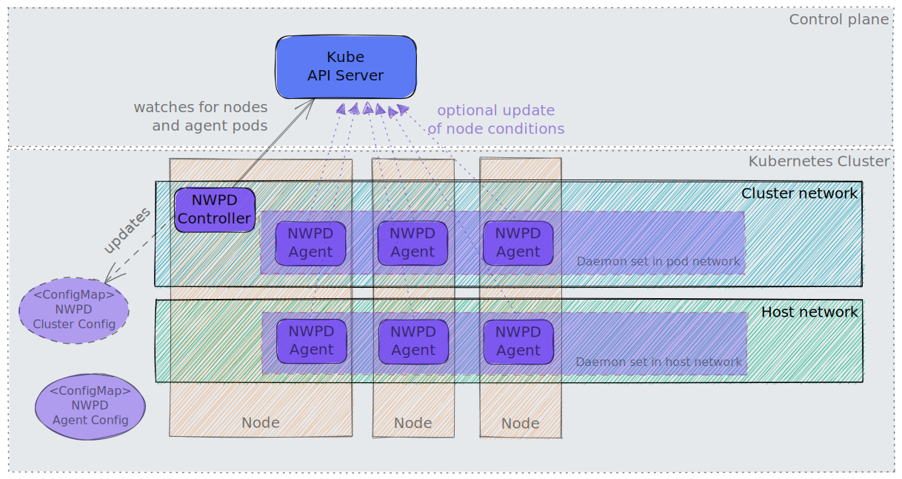

# Network Problem Detector

[](https://reuse.software/)

The Network Problem Detector performs network-related periodic checks between all nodes of a Kubernetes cluster,
to its Kube API server and/or external endpoints. Checks are performed using TCP connections, HTTPS GET requests, DNS lookups (UDP), or
Ping (ICMP).

## Architecture

The Network Problem Detector (NWPD) consists of two daemon sets and a separate controller.
  - one daemon set on the cluster network running a first set of agents on all worker nodes
  - another daemon set on the host network running a second set of agents on all worker node
  - the controller watches for changes on nodes and agent pods and updates the **cluster config** consumed by the agents.

A agent pod performs checks periodically as defined by the configuration in **agent config** `ConfigMap`.
The agents need to know about all nodes and agent pods on the cluster network for checking node-to-node communication.
But they don't communicate with the kube apiserver to watch for resources.
Instead they rely on the information provided by the **cluster config** `ConfigMap`
which is mounted as a volume in the pod. This `ConfigMap` is updated by the NWPD controller, which watches for changes on
nodes and pods in the kube-system namespace. As soon as a kubelet discovers these changes, the agents see them as a file change.

The results of the checks are stored locally on the node filesystem for later inspection with the `nwpdcli` command line tool.
Additionally they are also exposed as metrics for scrapping by Prometheus.
By enabling the `K8s exporter`, the agents periodically patch the node conditions `ClusterNetworkProblem` and `HostNetworkProblem` in 
the status of the node resources. If checks are failing, a summarising event is created too.
The `K8s exporter` is the only part of the agent which talks to the kube-apiserver.




*Note:* When the NWPD is deployed by the [gardener-extension-shoot-networking-problemdetector](https://github.com/gardener/gardener-extension-shoot-networking-problemdetector),
the NWPD controller is deployed in the shoot control plane.

## Deployment

### Get Started: Adhoc stand-alone deployment

To get started, the Network Problem Detector is deployed without integration with other tools.

*Side remark:*

This is the fatest way to get started with NWPD. In a productive environment, you may prefer to scrap the check results 
using [Prometheus](https://prometheus.io/) from metrics HTTP endpoints 
exposed by the agent pods. You may still follow this stand-alone installation, but 
you will need additional configuration on the Prometheus side which is not covered here.
For more details see [Access check results by Prometheus metrics](#access-check-results-by-prometheus-metrics) below.

Here we rely on the local collection created by each agent on the node file system. This collection keeps the check
results for the last several hours before they are garbage collected.

Follow these steps to deploy NWPD to a Kubernetes cluster:

1. Checkout the latest release and build the `nwpdcli` with

   ```bash
   make build-local
   ```

2. Set the `KUBECONFIG` environment variable to the kubeconfig of the cluster

3. Apply the two daemon sets (one for the host network, one for the pod network) with

   ```bash
   ./nwpdcli deploy agent
   ```

   This step will also provide a default configuration with jobs for the daemon sets on node and pod networks. See below for more details.

   *Note:* Run `./nwpdcli deploy agent --help` to see more options.


4. Optional: In a second shell run the controller to update the configuration on changes of nodes and pod endpoints of the pod network daemon set with

   ```bash
   ./nwpdcli run-controller 
   ```

   Alternatively install the agent controller with

   ```bash
   ./nwpdcli deploy controller 
   ```

6. Collect the observations from all nodes with

   ```bash
   ./nwpdcli collect
   ```

7. Aggregate the observations in text or SVG form

   ```bash
   ./nwpdcli aggr --minutes 10 --svg-output aggr.html
   open aggr.html # to open the html on Mac OS
   ```

   Your may apply filters on time window, source, destination or job ID to restrict the aggregation. See `./nwpdcli aggr --help` for more details.

7. Optional: Repeat steps 5. and 6. anytime


8. Drill down with query for specific observations

   If you need to drill down to specific observations, you may use

   ```bash
   ./nwpdcli query --help
   ```

9. Remove daemon sets with

   ```bash
   ./nwpdcli deploy agent --delete
   ```

10. Optional: Remove controller deployment  with

    ```bash
    ./nwpdcli deploy controller --delete
    ```

### Deployment in a Gardener landscape

The Network Problem Detector can be deployed automatically in a [Gardener](https://github.com/gardener/gardener) landscape.
Please see project [gardener-extension-shoot-networking-problemdetector](https://github.com/gardener/gardener-extension-shoot-networking-problemdetector)
for more details.

In this case, the check results are available as Prometheus metrics and can be accessed by a predefined Grafana dashboard.

#### Access check results by Prometheus metrics

Two metrics are exposed.

- `nwpd_aggregated_observations`
  This is a counter vector with the total count of an observation (result of a check) and has these labels:
   - `src`: name of node the checking agent is running
   - `dest`: name of the destination node or endpoint
   - `jobid`: job id of the job definition
   - `status`: result of the check, either `ok` or `failed`

- `nwpd_aggregated_observations_latency_secs`
  This is a gauge vector with the duration of the last successful observation in seconds and has these labels:
   - `src`: name of node the checking agent is running
   - `dest`: name of the destination node or endpoint
   - `jobid`: job id of the job definition

## Default Configuration of Check Jobs

Checks are defined as jobs using virtual command lines. These command lines are just Go routines executed periodically from the agent running in the pods of the two daemon sets.
There are two daemon sets. One running in the host network (i.e. using the host network in the pod), the other one running in the cluster (=pod) network.

### Default configuration

To examine the current default configuration, run the command

```bash
./nwpdcli deploy print-default-config
```

### Job types

1. `checkTCPPort [--period <duration>] [--scale-period] [--endpoints <host1:ip1:port1>,<host2:ip2:port2>,...] [--endpoints-of-pod-ds] [--node-port <port>] [--endpoint-internal-kube-apiserver] [--endpoint-external-kube-apiserver]`

   Tries to open a connection to the given `IP:port`. There are multipe variants:
   - using an explicit list of endpoints with `--endpoints`
   - using the known pod endpoints of the pod network daemon set
   - using a node port on all known nodes
   - the cluster internal address of the kube-apiserver (IP address of `kubernetes.default.svc.cluster.local`)
   - the external address of the kube-apiserver

   The checks run in a robin round fashion after an initial random shuffle. The global default period between two checks can overwritten with the `--period` option.
   With `--scale-period` the period length is increased by a factor `sqrt(<number-of-nodes>)` to reduce the number of checks per node.

   Note that known nodes and pod endpoints are only updated by the controller. Changes are applied as soon as the changed config maps are discovered by the kubelets.
   This typically happens within a minute.

3. `checkHTTPSGet [--period <duration>] [--scale-period] [--endpoints <host1[:port1]>,<host2[:port2]>,...] [--endpoint-internal-kube-apiserver] [--endpoint-external-kube-apiserver]`

   Tries to open a connection to the given `IP:port`. There are multipe variants:
   - using an explicit list of endpoints with `--endpoints`
   - the cluster internal address of the kube-apiserver
   - the external address of the kube-apiserver

   The checks run in a robin round fashion after an inital random shuffle. The global default period between two checks can overwritten with the `--period` option.
   With `--scale-period` the period length is increased by a factor `sqrt(<number-of-nodes>)` to reduce the number of checks per node.

4. `nslookup [--period <duration>] [--scale-period] [--names host1,host2,...] [--name-internal-kube-apiserver"] [--name-external-kube-apiserver]`

   Looks up hosts using the local resolver of the pod or the node (for agents running in the host network). 

5. `pingHost [--period <duration>] [--scale-period] [--hosts <host1:ip1>,<host2:ip2>,...]`

   Robin round ping to all nodes or the provided host list. The  node or host list is shuffled randomly on start.
   The global default period between two pings can overwritten with the `--period` option.

   The pod needs `NET_ADMIN` capabilities to be allowed to perform pings.


### Default jobs for the daemon set on the **host network**

| Job ID            | Job Type        | Description                                                                                                                                                           |
|-------------------|-----------------|-----------------------------------------------------------------------------------------------------------------------------------------------------------------------|
| `https-n2api-ext` | `checkHTTPSGet` | HTTPS Get check from all pods of the daemon set of the host network to the external address of the Kube API server.                                                   |
| `nslookup-n`      | `nslookup`      | DNS Lookup of IP addresses for the domain name `eu.gcr.io`, and external name of Kube API server.                                                                     |
| `tcp-n2api-ext`   | `checkTCPPort`  | TCP connection check from all pods of the daemon set of the host network to the external address of the Kube API server.                                              |
| `tcp-n2api-int`   | `checkTCPPort`  | TCP connection check from all pods of the daemon set of the host network to the internal address of the Kube API server.                                              |
| `tcp-n2n`         | `checkTCPPort`  | TCP connection check from all pods of the daemon set of the host network to the node port used by the NWPD agent on the host network.                                 |
| `tcp-n2p`         | `checkTCPPort`  | TCP connection check from all pods of the daemon set of the host network to pod endpoints (pod IP, port of GRPC server) of the daemon set running in the pod network. | 

The job IDs of the default configuration on the host (=node) network are using the naming convention `<jobtype-shortcut>-n[2<destination>][-(int|ext)]`.

### Default jobs for the daemon set on the **cluster network**


| Job ID            | Job Type        | Description                                                                                                                                                           |
|-------------------|-----------------|-----------------------------------------------------------------------------------------------------------------------------------------------------------------------|
| `https-p2api-ext` | `checkHTTPSGet` | HTTPS Get check from all pods of the daemon set on the cluster network to the external address of the Kube API server.                                                |
| `https-p2api-int` | `checkHTTPSGet` | HTTPS Get check from all pods of the daemon set on the cluster network to the internal address of the Kube API server (`kubernetes.default.svc.cluster.local.:443`).      |
| `nslookup-p`      | `nslookup`      | Lookup of IP addresses for external DNS name `eu.gcr.io`, and internal and external names of Kube API server.                                                         |
| `tcp-p2api-ext`   | `checkTCPPort`  | TCP connection check from all pods of the daemon set on the cluster network to the external address of the Kube API server.                                               |
| `tcp-p2api-int`   | `checkTCPPort`  | TCP connection check from all pods of the daemon set of the cluster network to the internal address of the Kube API server.                                              |
| `tcp-p2n`         | `checkTCPPort`  | TCP connection check from all pods of the daemon set of the cluster network to the node port used by the NWPD agent on the host network.                                 |
| `tcp-p2p`         | `checkTCPPort`  | TCP connection check from all pods of the daemon set of the cluster network to pod endpoints (pod IP, port of GRPC server) of the daemon set running in the pod network. | 

The job IDs of the default configuration on the cluster (=pod) network are using the naming convention `<jobtype-shortcut>-p[2<destination>][-(int|ext)]`.
